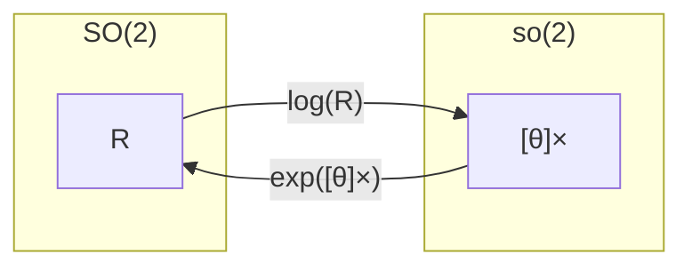

:::note info
目標：指数写像と対数写像を理解しよう
:::

本記事はこちらを元に解説する
[Lie Groups for 2D and 3D Transformations](https://www.ethaneade.com/lie.pdf)


# 1. 概要
## 1.1 指数写像と対数写像について
リー群とリー代数の間の変換は指数写像(Exponential map)、対数写像(Logarithmic map)を用いて行う。  
([写像の復習](https://mathlandscape.com/bijection/))

**指数写像**は、リー代数 $\boldsymbol{\mathfrak{g}}$ の元を、対応するリー群 $G$ の元に写像する操作。

~~~math
\exp: \boldsymbol{\mathfrak{g}} \to G
~~~

**対数写像**は、リー群 $G$ の元を、リー代数 $\boldsymbol{\mathfrak{g}}$ の元に写像する操作。

~~~math
\log: G \to \boldsymbol{\mathfrak{g}}
~~~

## 1.2 SO(2)でデモ
**指数写像のデモ**： [Lie-learning/3/exp_test.py](https://github.com/MapIV/Lie-learning)


**リー群**
~~~math
R = \begin{pmatrix} \cos \theta & -\sin \theta \\ \sin \theta & \cos \theta \end{pmatrix} \in SO(2)
~~~

**リー代数**
~~~math
\theta \in \mathbb{R}, \quad J = \begin{pmatrix} 0 & -1 \\ 1 & 0 \end{pmatrix}, \\ \quad [\boldsymbol{\theta}]_\times = \begin{pmatrix} 0 & -\theta \\ \theta & 0 \end{pmatrix} \in \mathfrak{so}(2)
~~~

**exp map**
~~~math
R = \exp([\boldsymbol{\theta}]_\times) = \begin{pmatrix} \cos \theta & -\sin \theta \\ \sin \theta & \cos \theta \end{pmatrix} \in SO(2) 
~~~

**log map**
~~~math
\log(R) = [\boldsymbol{\theta}]_\times = \arctan({R_{12}},{R_{11}}) \in \mathfrak{so}(2)
~~~

**$SO(2)$と$\mathfrak{so}(2)$の関係図**


# 2. SO(3)
## 2.1 指数写像 (Exponential map)
### 計算式
~~~math
[\boldsymbol{\omega}]_\times \in \mathfrak{so}(3), \quad \boldsymbol{\omega} \in \mathbb{R}^3, \quad \theta = \|\boldsymbol{\omega}\|
~~~

~~~math
\exp([\boldsymbol{\omega}]_\times) = \boldsymbol{I} + \left( \frac{\sin \theta}{\theta} \right) [\boldsymbol{\omega}]_\times + \left( \frac{1 - \cos \theta}{\theta^2} \right) [\boldsymbol{\omega}]_\times^2
~~~

### 式の導出
$\mathfrak{so}(3)$ から $SO(3)$ への指数写像は、行列指数関数を用いて、次のようになる。

~~~math
\exp([\boldsymbol{\omega}]_\times) = \exp \left( \begin{pmatrix} 
0 & -\omega_3 & \omega_2 \\ 
\omega_3 & 0 & -\omega_1 \\ 
-\omega_2 & \omega_1 & 0 
\end{pmatrix} \right) = \boldsymbol{I} + [\boldsymbol{\omega}]_\times + \frac{1}{2!} [\boldsymbol{\omega}]_\times^2 + \frac{1}{3!} [\boldsymbol{\omega}]_\times^3 + \dots
~~~

（参考：[CV・CG・ロボティクスのためのリー群・リー代数入門: (2) 行列指数関数](https://swkagami.hatenablog.com/entry/lie_02exp#%E8%A1%8C%E5%88%97%E5%AF%BE%E6%95%B0%E9%96%A2%E6%95%B0)）

項をペアで書くと、次のようになる。

~~~math
\exp([\boldsymbol{\omega}]_\times) = \boldsymbol{I} + \sum_{i=0}^{\infty} \left[ \frac{1}{(2i+1)!} [\boldsymbol{\omega}]_\times^{2i+1} + \frac{1}{(2i+2)!} [\boldsymbol{\omega}]_\times^{2i+2} \right]
~~~

ここで、歪対称行列の特性を利用する。

~~~math
[\boldsymbol{\omega}]_\times^3 = -(\boldsymbol{\omega}^T \boldsymbol{\omega}) \cdot [\boldsymbol{\omega}]_\times 
~~~

~~~math
\theta^2 \equiv \boldsymbol{\omega}^T \boldsymbol{\omega}
~~~

$[\boldsymbol{\omega}] \_\times$を3回かけると、元の$[\boldsymbol{\omega}] \_\times$にスカラー$-\theta^2$をかけたものに戻るという周期的な性質を持っている。従って、次のような一般式で表せる。

~~~math
[\boldsymbol{\omega}]_\times^{2i+1} = (-1)^i \theta^{2i} [\boldsymbol{\omega}]_\times
~~~

~~~math
[\boldsymbol{\omega}]_\times^{2i+2} = (-1)^i \theta^{2i} [\boldsymbol{\omega}]_\times^2
~~~

指数写像の級数を因数分解して、係数のテイラー展開を以下のように閉形式で表すことができる。

~~~math
\begin{align}
\exp([\boldsymbol{\omega}]_\times) &= \boldsymbol{I} + \left( \sum_{i=0}^{\infty} \frac{(-1)^i \theta^{2i}}{(2i+1)!} \right) [\boldsymbol{\omega}]_\times + \left( \sum_{i=0}^{\infty} \frac{(-1)^i \theta^{2i}}{(2i+2)!} \right) [\boldsymbol{\omega}]_\times^2 \tag{1}\\
&= \boldsymbol{I} + \left( 1 - \frac{\theta^2}{3!} + \frac{\theta^4}{5!} - \dots \right) [\boldsymbol{\omega}]_\times + \left( \frac{1}{2!} - \frac{\theta^2}{4!} + \frac{\theta^4}{6!} - \dots \right) [\boldsymbol{\omega}]_\times^2 \tag{2}\\
&= \boldsymbol{I} + \left( \frac{\sin \theta}{\theta} \right) [\boldsymbol{\omega}]_\times + \left( \frac{1 - \cos \theta}{\theta^2} \right) [\boldsymbol{\omega}]_\times^2 \tag{3}
\end{align}
~~~

式(2)から式(3)への変換は、$\sin \theta$と$\cos \theta$のテイラー展開を利用している。
~~~math
\sin \theta = \theta - \frac{\theta^3}{3!} + \frac{\theta^5}{5!} - \dots
~~~
~~~math
\cos \theta = 1 - \frac{\theta^2}{2!} + \frac{\theta^4}{4!} - \dots
~~~

式(3)は有名なロドリゲスの公式である。指数写像の結果は、$\boldsymbol{\omega}$ によって与えられる軸周りを $\theta$ ラジアン回転することになる。

$\theta$ が小さい場合は、式(2)のように係数$\left( \frac{\sin \theta}{\theta} \right)$と$\left( \frac{1 - \cos \theta}{\theta^2} \right)$のテイラー展開（機械精度を考慮して適切な項数を選択）を使用するべきである。

## 2.2 対数写像 (Logarithm map)
### 計算式
~~~math
\boldsymbol{R} \in SO(3), \quad \theta = \arccos\left(\frac{\mathrm{tr}(\boldsymbol{R}) - 1}{2}\right)
~~~
~~~math
\ln(\boldsymbol{R}) = \frac{\theta}{2\sin\theta} \cdot (\boldsymbol{R} - \boldsymbol{R}^T)
~~~

### 式の導出
Logmapは指数写像の逆の操作であるため、指数写像の式から導出する。

**$\theta$ の導出**

式(3)の両辺のトレース（trace, 対角成分の和）を計算する。各項のトレースは以下のようになる。

-   $\mathrm{tr}(\boldsymbol{I}) = 3$
-   $\mathrm{tr}([\boldsymbol{\omega}]\_\times) = 0$ （歪対称行列の対角成分は全て0のため）
-   $\mathrm{tr}([\boldsymbol{\omega}]\_\times^2) = -2\theta^2$ （$[\boldsymbol{\omega}]_\times^2 = \boldsymbol{\omega}\boldsymbol{\omega}^T - (\boldsymbol{\omega}^T\boldsymbol{\omega})\boldsymbol{I}$ と $\theta^2 = \boldsymbol{\omega}^T\boldsymbol{\omega}$ より）

これらを使って式(3)のトレースを計算すると、

~~~math
\begin{align}
\mathrm{tr}(\boldsymbol{R}) &= \mathrm{tr}(\boldsymbol{I}) + \left( \frac{\sin \theta}{\theta} \right) \mathrm{tr}([\boldsymbol{\omega}]_\times) + \left( \frac{1 - \cos \theta}{\theta^2} \right) \mathrm{tr}([\boldsymbol{\omega}]_\times^2) \notag \\
&= 3 + \left( \frac{\sin \theta}{\theta} \right) \cdot 0 + \left( \frac{1 - \cos \theta}{\theta^2} \right) (-2\theta^2) \notag \\
&= 3 - 2(1 - \cos \theta) \notag \\
&= 1 + 2\cos \theta \notag
\end{align}
~~~

この式を $\theta$ について解くと、目的の式が得られる。

~~~math
\cos \theta = \frac{\mathrm{tr}(\boldsymbol{R}) - 1}{2} \quad \Rightarrow \quad \theta = \arccos\left(\frac{\mathrm{tr}(\boldsymbol{R}) - 1}{2}\right)
~~~

**$[\boldsymbol{\omega}]\_\times$ の導出**


$\boldsymbol{R}^T$ は、歪対称行列の性質 $([\boldsymbol{\omega}]\_\times)^T = -[\boldsymbol{\omega}]\_\times$ と、対称行列の性質 $([\boldsymbol{\omega}]\_\times^2)^T = [\boldsymbol{\omega}]\_\times^2$ を使うと、以下のようになる。

~~~math
\boldsymbol{R}^T = \boldsymbol{I} - \left( \frac{\sin \theta}{\theta} \right) [\boldsymbol{\omega}]_\times + \left( \frac{1 - \cos \theta}{\theta^2} \right) [\boldsymbol{\omega}]_\times^2 \quad \cdots \tag{4}
~~~

式(3)から式(4)を引くと、

~~~math
\boldsymbol{R} - \boldsymbol{R}^T = 2 \frac{\sin \theta}{\theta} [\boldsymbol{\omega}]_\times
~~~

この式を $[\boldsymbol{\omega}]\_\times$ について解く。$\ln(\boldsymbol{R}) = [\boldsymbol{\omega}]\_\times$ であるため、これがLogmapの式となる。

~~~math
\ln(\boldsymbol{R}) = [\boldsymbol{\omega}]_\times = \frac{\theta}{2\sin\theta} (\boldsymbol{R} - \boldsymbol{R}^T)
~~~

$\theta$が0に近い場合は、係数$\frac{\theta}{2\sin\theta}$のテイラー展開を使用すべきである。

## 2.3 実装
💻**ソースコードを参照する**
- 回転に関する実装：[Rot3.h](https://github.com/borglab/gtsam/blob/f65a66194b10a78df2abf877bccb65d490514a46/gtsam/geometry/Rot3.h#L58-L59)
- 指数写像の実装：[SO3.cpp gtsam::so3::ExpmapFunctor::expmap()](https://github.com/borglab/gtsam/blob/f65a66194b10a78df2abf877bccb65d490514a46/gtsam/geometry/SO3.cpp#L112)
- $\theta$が0に近い場合の処理：[SO3.cpp gtsam::so3::ExpmapFunctor::init()](https://github.com/borglab/gtsam/blob/f65a66194b10a78df2abf877bccb65d490514a46/gtsam/geometry/SO3.cpp#L86) 
- 対数写像の実装：[SO3.cpp gtsam::SO3::Logmap()](https://github.com/borglab/gtsam/blob/f65a66194b10a78df2abf877bccb65d490514a46/gtsam/geometry/SO3.cpp#L298)

⌨**実装例**
```c++
#include <gtsam/geometry/Rot3.h>
#include <iostream>

int main() {
    using namespace gtsam;

    // 適当な回転行列
    Rot3 R = Rot3::RzRyRx(0.1, -0.2, 0.3);

    // 回転行列 -> 回転ベクトル
    Vector3 omega = R.log();

    // 回転ベクトル -> 回転行列
    Rot3 R_recovered = Rot3::Expmap(omega);

    return 0;
}
```


# 3. SE(3)
## 3.1 指数写像 (Exponential map)
### 計算式
~~~math
\boldsymbol{\delta} = (\boldsymbol{u} \quad \boldsymbol{\omega}) \in \mathbb{R}^3, \quad \theta = \|\boldsymbol{\omega}\|
~~~

~~~math
\boldsymbol{\delta}^\wedge = \begin{pmatrix}
[\boldsymbol{\omega}]_\times & \boldsymbol{u} \\
0 & 0
\end{pmatrix} \in \mathfrak{se}(3)
~~~

~~~math
A = \frac{\sin \theta}{\theta}, \quad B = \frac{1 - \cos \theta}{\theta^2}, \quad C = \frac{1 - A}{\theta^2}
~~~

~~~math
\boldsymbol{R} = \boldsymbol{I} + A[\boldsymbol{\omega}]_\times + B[\boldsymbol{\omega}]_\times^2
~~~

~~~math
V = \boldsymbol{I} + B[\boldsymbol{\omega}]_\times + C[\boldsymbol{\omega}]_\times^2
~~~

~~~math
\exp\left(
\begin{pmatrix}
\boldsymbol{u} \\
\boldsymbol{\omega}
\end{pmatrix}
\right) = \begin{pmatrix} \boldsymbol{R} & V\boldsymbol{u} \\ 0 & 1 \end{pmatrix}
~~~


### 式の導出
$\mathfrak{se}(3)$ から$SE(3)$への指数写像は、行列指数関数を用いると、以下のようになる。

~~~math
\boldsymbol{\delta}^\wedge = \begin{pmatrix}
[\boldsymbol{\omega}]_\times & \boldsymbol{u} \\
0 & 0
\end{pmatrix} \in \mathfrak{se}(3)
~~~

~~~math
\exp(\boldsymbol{\delta}) = \boldsymbol{I} + \boldsymbol{\delta} + \frac{1}{2!}\boldsymbol{\delta}^{\wedge^{2}} + \frac{1}{3!}\boldsymbol{\delta}^{\wedge^{3}} + \cdots
~~~

ここで、

~~~math
\boldsymbol{\delta}^{\wedge^{2}} = \begin{pmatrix} [\boldsymbol{\omega}]_\times & \boldsymbol{u} \\ 0 & 0 \end{pmatrix} \begin{pmatrix} [\boldsymbol{\omega}]_\times & \boldsymbol{u} \\ 0 & 0 \end{pmatrix} = \begin{pmatrix} [\boldsymbol{\omega}]_\times^2 & [\boldsymbol{\omega}]_\times \boldsymbol{u} \\ 0 & 0 \end{pmatrix}
~~~

~~~math
\boldsymbol{\delta}^{\wedge^{3}} = \begin{pmatrix} [\boldsymbol{\omega}]_\times & \boldsymbol{u} \\ 0 & 0 \end{pmatrix} \begin{pmatrix} [\boldsymbol{\omega}]_\times^2 & [\boldsymbol{\omega}]_\times \boldsymbol{u} \\ 0 & 0 \end{pmatrix} = \begin{pmatrix} [\boldsymbol{\omega}]_\times^3 & [\boldsymbol{\omega}]_\times^2 \boldsymbol{u} \\ 0 & 0 \end{pmatrix}
~~~

なので、

~~~math
\exp(\boldsymbol{\delta}^\wedge) = \boldsymbol{I} + \begin{pmatrix} [\boldsymbol{\omega}]_\times & \boldsymbol{u} \\ 0 & 0 \end{pmatrix} + \frac{1}{2!} \begin{pmatrix} [\boldsymbol{\omega}]_\times^2 & [\boldsymbol{\omega}]_\times \boldsymbol{u} \\ 0 & 0 \end{pmatrix} + \frac{1}{3!} \begin{pmatrix} [\boldsymbol{\omega}]_\times^3 & [\boldsymbol{\omega}]_\times^2 \boldsymbol{u} \\ 0 & 0 \end{pmatrix} + \cdots
~~~

回転ブロックは$SO(3)$と同じであるが、並進成分は異なるべき級数になる。

~~~math
\exp\left(
\begin{pmatrix}
[\boldsymbol{\omega}]_\times & \boldsymbol{u} \\
0 & 0
\end{pmatrix}
\right) = \begin{pmatrix} \exp([\boldsymbol{\omega}]_\times) & V\boldsymbol{u} \\ 0 & 1 \end{pmatrix}
~~~

~~~math
V = \boldsymbol{I} + \frac{1}{2!}[\boldsymbol{\omega}]_\times + \frac{1}{3!}[\boldsymbol{\omega}]_\times^2 + \cdots
~~~

項を奇数乗と偶数乗に分割し、因数分解する。

~~~math
V = \boldsymbol{I} + \sum_{i=0}^{\infty} \left[\frac{1}{(2i+2)!}[\boldsymbol{\omega}]_\times^{2i+1} + \frac{1}{(2i+3)!}[\boldsymbol{\omega}]_\times^{2i+2}\right]
~~~

~~~math
= \boldsymbol{I} + \left( \sum_{i=0}^{\infty} \frac{(-1)^i \theta^{2i}}{(2i+2)!} \right) [\boldsymbol{\omega}]_\times + \left( \sum_{i=0}^{\infty} \frac{(-1)^i \theta^{2i}}{(2i+3)!} \right) [\boldsymbol{\omega}]_\times^2
~~~

係数はテイラー展開で、

~~~math
\sum_{i=0}^{\infty} \frac{(-1)^i \theta^{2i}}{(2i+2)!} = \frac{1}{2!} - \frac{\theta^2}{4!} + \frac{\theta^4}{6!} - \cdots = \frac{1 - \cos \theta}{\theta^2}
~~~

~~~math
\sum_{i=0}^{\infty} \frac{(-1)^i \theta^{2i}}{(2i+3)!} = \frac{1}{3!} - \frac{\theta^2}{5!} + \frac{\theta^4}{7!} - \cdots = \frac{\theta - \sin \theta}{\theta^3}
~~~

となり、Vは以下のようにまとめられる。

~~~math
V = \boldsymbol{I} + \left( \frac{1 - \cos \theta}{\theta^2} \right) [\boldsymbol{\omega}]_\times + \left( \frac{\theta - \sin \theta}{\theta^3} \right) [\boldsymbol{\omega}]_\times^2
~~~

$\theta^2$が小さい場合、$A, B, C$のテイラー展開を使用すべきである。

## 3.2 対数写像 (Logarithm map)
### 計算式
~~~math
T = \begin{pmatrix} \boldsymbol{R} & \boldsymbol{t} \\ 0 & 1 \end{pmatrix} \in SE(3), \quad
\ln(T) = \begin{pmatrix} [\boldsymbol{\omega}]_\times & \boldsymbol{u} \\ 0 & 0 \end{pmatrix} \in \mathfrak{se}(3)
~~~

回転部分の$\ln$は $SO(3)$ と同様である。
並進部分は次で与えられる。

~~~math
\boldsymbol{u} = V^{-1}\,\boldsymbol{t}
~~~

~~~math
V^{-1} = \boldsymbol{I} - \frac{1}{2} [\boldsymbol{\omega}]_\times + \frac{1}{\theta^2} \left(1 - \frac{A}{2B}\right) [\boldsymbol{\omega}]_\times^2
~~~

### 導出

指数写像において、$V$は以下のように定義された。

~~~math
V = \boldsymbol{I} + A[\boldsymbol{\omega}]_\times + B[\boldsymbol{\omega}]_\times^2
~~~

ここで、$A = \frac{1-\cos\theta}{\theta^2}$、$B = \frac{\theta-\sin\theta}{\theta^3}$である。

$V^{-1}$を求めるために、$V$の逆行列を直接計算する代わりに、$V$と同じ形の行列を仮定する。

~~~math
V^{-1} = \boldsymbol{I} + \alpha[\boldsymbol{\omega}]_\times + \beta[\boldsymbol{\omega}]_\times^2
~~~

$V \cdot V^{-1} = \boldsymbol{I}$の条件から、係数$\alpha$と$\beta$を求める。

~~~math
(\boldsymbol{I} + A[\boldsymbol{\omega}]_\times + B[\boldsymbol{\omega}]_\times^2)(\boldsymbol{I} + \alpha[\boldsymbol{\omega}]_\times + \beta[\boldsymbol{\omega}]_\times^2) = \boldsymbol{I}
~~~

左辺を展開すると：

~~~math
\begin{align}
&= \boldsymbol{I} + \alpha[\boldsymbol{\omega}]_\times + \beta[\boldsymbol{\omega}]_\times^2 \nonumber \\
&\quad + A[\boldsymbol{\omega}]_\times + A\alpha[\boldsymbol{\omega}]_\times^2 + A\beta[\boldsymbol{\omega}]_\times^3 \nonumber \\
&\quad + B[\boldsymbol{\omega}]_\times^2 + B\alpha[\boldsymbol{\omega}]_\times^3 + B\beta[\boldsymbol{\omega}]_\times^4 \nonumber
\end{align}
~~~

$[\boldsymbol{\omega}]\_\times^3 = -\theta^2[\boldsymbol{\omega}]\_\times$および$[\boldsymbol{\omega}]\_\times^4 = -\theta^2[\boldsymbol{\omega}]\_\times^2$の性質を用いて整理すると：

~~~math
\begin{align}
&= \boldsymbol{I} + (A + \alpha)[\boldsymbol{\omega}]_\times \nonumber \\
&\quad + (B + A\alpha + \beta)[\boldsymbol{\omega}]_\times^2 \nonumber \\
&\quad + (-A\beta\theta^2 - B\alpha\theta^2)[\boldsymbol{\omega}]_\times \nonumber \\
&\quad + (-B\beta\theta^2)[\boldsymbol{\omega}]_\times^2 \nonumber
\end{align}
~~~

~~~math
= \boldsymbol{I} + (A + \alpha - A\beta\theta^2 - B\alpha\theta^2)[\boldsymbol{\omega}]_\times + (B + A\alpha + \beta - B\beta\theta^2)[\boldsymbol{\omega}]_\times^2
~~~

これが$\boldsymbol{I}$に等しくなるためには、各次数の係数がゼロでなければならない：

- $[\boldsymbol{\omega}]\_\times$の係数：$A + \alpha - A\beta\theta^2 - B\alpha\theta^2 = 0$
- $[\boldsymbol{\omega}]\_\times^2$の係数：$B + A\alpha + \beta - B\beta\theta^2 = 0$

1次近似では高次項を無視して：
- $A + \alpha = 0$ より $\alpha = -A = -\frac{1-\cos\theta}{\theta^2}$
- $B + A\alpha + \beta = 0$ より $\beta = -B - A\alpha = -B + A^2$

$A = \frac{1-\cos\theta}{\theta^2}$、$B = \frac{\theta-\sin\theta}{\theta^3}$を用いて計算すると：

~~~math
\alpha = -\frac{1}{2}, \quad \beta = \frac{1}{\theta^2}\left(1 - \frac{A}{2B}\right)
~~~

したがって：

~~~math
V^{-1} = \boldsymbol{I} - \frac{1}{2}[\boldsymbol{\omega}]_\times + \frac{1}{\theta^2}\left(1 - \frac{A}{2B}\right)[\boldsymbol{\omega}]_\times^2
~~~


## 3.3 実装
💻**ソースコードを見てみよう**
- 剛体変換に関する実装：[Pose3.h](https://github.com/borglab/gtsam/blob/f65a66194b10a78df2abf877bccb65d490514a46/gtsam/geometry/Pose3.h#L37)
- 指数写像の実装：[Pose3.cpp gtsam::Pose3::Expmap()](https://github.com/borglab/gtsam/blob/f65a66194b10a78df2abf877bccb65d490514a46/gtsam/geometry/Pose3.cpp#L217)
- 対数写像の実装：[Pose3.cpp gtsam::Pose3::Logmap()](https://github.com/borglab/gtsam/blob/f65a66194b10a78df2abf877bccb65d490514a46/gtsam/geometry/Pose3.cpp#L257)

⌨**実装例**
```c++
#include <gtsam/geometry/Pose3.h>
#include <gtsam/geometry/Rot3.h>
#include <gtsam/base/Vector.h>
#include <iostream>

int main() {
  using namespace gtsam;

  // 適当なPose3（回転＋並進）
  Pose3 T(Rot3::RzRyRx(0.1, -0.2, 0.3), Point3(1.0, 2.0, 3.0));

  // Pose3 -> se(3)（Vector6: [omega(3), v(3)]）
  Vector6 xi = Pose3::Logmap(T);

  // se(3) -> Pose3
  Pose3 T_recovered = Pose3::Expmap(xi);

  return 0;
}
```

## まとめ
- リー代数からリー群への変換は指数写像、リー群からリー代数への変換は対数写像を用いる。
- $\mathfrak{so}(3)$ から $SO(3)$ への指数写像はロドリゲスの公式となっている。
- 最後に、[IMU Preintegration on Manifold for Efficient Visual-Inertial Maximum-a-Posteriori Estimation](https://www.roboticsproceedings.org/rss11/p06.pdf)の式(6)まで読めるようになっているか確認することを推奨する。
