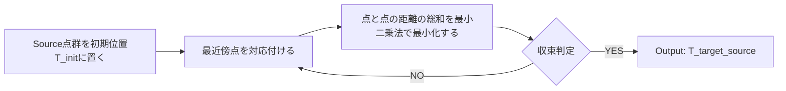

:::note info
目標：なぜリー代数を用いた位置姿勢のパラメータの最適化が便利なのか理解しよう
:::

この記事は、[ロボット技術者向け リー群の速習(4) リー群を用いた最適化](https://qiita.com/scomup/items/a9c09d57101583c58619)を踏襲して、[small_gicp](https://github.com/koide3/small_gicp/tree/master)のソースコードを用いながら解説する記事となります。

## 1. ICP registrationについて
Source点群（赤色）の一点一点をTarget点群（黒色）における最近傍点と対応付け、点と点の距離の総和を最小二乗法で最小化する。

### 1.1 デモ

[Source code: (icp_registration)]()

### 1.2 フローチャート

## 2. 最小二乗法について
**残差関数を最小化する**ために、**パラメータを用意**して**どれくらいの量を動かせばよいか**を考える。
### 2.1 残差関数
Target点群を $\mathcal{M} = \lbrace \boldsymbol{m}_n \in \mathbb{R}^3 | _{n=1\ldots N} \rbrace$、Source点群を $\mathcal{S} = \lbrace \boldsymbol{s}_n \in \mathbb{R}^3 |  _{n=1\ldots N} \rbrace$とする。

また、$\boldsymbol{R} \in SO(3)$、$\boldsymbol{t} \in \mathbb{R}^3$として、Source点群座標系からTarget点群座標系への変換行列を$T = [\boldsymbol{R} | \boldsymbol{t}] \in SE(3)$とする。

点群のマッチングを行うには、変換行列$T$をパラメータとして、以下の残差関数の最小化問題を考える。
~~~math
\boldsymbol{e}_i(\boldsymbol{T}) = \boldsymbol{m}_i - (\boldsymbol{R} \boldsymbol{s}_i + \boldsymbol{t})
~~~

~~~math
\arg\min_{\boldsymbol{T}} \sum_{i} \| \boldsymbol{e}_i(\boldsymbol{T}) \|^2
~~~

### 2.2 リー代数を用いたパラメータ化
実際に最小二乗法を解くときには、リー代数$\mathfrak{se}(3)$を用いることでパラメータの数を最小限の6つにする。
~~~math
\boldsymbol{x}^\wedge = \begin{bmatrix} [\boldsymbol{\omega}]_\times & \boldsymbol{\upsilon} \\ \boldsymbol{0} & 0 \end{bmatrix} \in \mathfrak{se}(3)
~~~

ここで、$\mathfrak{se}(3)$のベクトル$\boldsymbol{x} = \begin{bmatrix} \boldsymbol{\omega} & \boldsymbol{\upsilon} \end{bmatrix}^T \in \mathbb{R}^6$のうち
- $\boldsymbol{\omega} \in \mathbb{R}^3$: 回転を表すパラメータ
- $\boldsymbol{\upsilon} \in \mathbb{R}^3$: 並進を表すパラメータ

である。
ベクトル$\boldsymbol{x}$は指数写像によって$\boldsymbol{T}$に変換する。
~~~math
\boldsymbol{T} = \exp\left(\begin{bmatrix} [\boldsymbol{\omega}]_\times & \boldsymbol{\upsilon} \\ \boldsymbol{0} & 0 \end{bmatrix}\right)
~~~

### 2.3 Gauss Newton法
Gauss-Newton法は、ニュートン法において、Hessianをヤコビアンの行列積で近似する手法である。

#### 更新
パラメータはその微小変位$\boldsymbol{\delta} \in \mathbb{R}^6$で更新される。
~~~math
\boldsymbol{x}_{k+1} = \boldsymbol{x}_k + \boldsymbol{\delta}
~~~

#### パラメータの更新量
更新量はヘシアンの逆行列と勾配で計算される。
~~~math
\boldsymbol{\delta} = -\boldsymbol{H}^{-1} \boldsymbol{g}
~~~
#### Hessian (ヘシアン)
Gauss-Newton法では、全点群ペアのヤコビアンを用いてヘシアンを次のように近似する。
~~~math
\boldsymbol{H} \approx \sum_{i} \boldsymbol{J}_i^T \boldsymbol{J}_i
~~~

#### Gradient (勾配)
勾配も同様に全点群ペアの寄与を累積する。
~~~math
\boldsymbol{g} = \sum_{i} \boldsymbol{J}_i^T \boldsymbol{e}_i
~~~

各点ペア $i$ について残差 $\boldsymbol{e}_i$ とヤコビアン $\boldsymbol{J}_i$ を計算し、それらを全点群数分加算することで、パラメータの更新量が計算できる。

ガウス・ニュートン法の詳細はこちらを参照
[最適化とガウス・ニュートン法の導出について](https://qiita.com/SolKul/items/61fce5278b26df9ca77f)

# 3. ヤコビアンの導出
同次座標で表現された点を $\tilde{\boldsymbol{m}}_i = [\boldsymbol{m}_i^T, 1]^T$、$\tilde{\boldsymbol{s}}_i = [\boldsymbol{s}_i^T, 1]^T$として、残差を
~~~math
\boldsymbol{e}_i(\boldsymbol{T}) = \tilde{\boldsymbol{m}}_i - (\boldsymbol{T} \exp(\boldsymbol{\delta}^\wedge) \tilde{\boldsymbol{s}}_i)
~~~
とする。ヤコビアンは残差 $\boldsymbol{e}_i$を$\boldsymbol{\delta}$で微分して求める：
~~~math
\boldsymbol{J}_i = \frac{\partial \boldsymbol{e}_i}{\partial \boldsymbol{\delta}} = -\frac{\partial (\boldsymbol{T} \exp(\boldsymbol{\delta}^\wedge) \tilde{\boldsymbol{s}}_i)}{\partial \boldsymbol{\delta}} \bigg|_{\boldsymbol{\delta}=\boldsymbol{0}}
~~~

以下の順番でヤコビアンの導出過程を説明する  
- 3.1 指数写像の一次近似について
- 3.2 分子の計算について
- 3.3 微分について

### 3.1 指数写像の一次近似について

指数写像
~~~math
\exp(\boldsymbol{\delta}^\wedge) = \boldsymbol{I} + \boldsymbol{\delta}^\wedge + \frac{1}{2!}(\boldsymbol{\delta}^\wedge)^2 + \cdots
~~~

において、$\boldsymbol{\delta}$ が微小量であるとき、$\boldsymbol{\delta}$ の二乗以上の高次の項は無視できるほど小さくなるため、以下の一次近似が成立する。
~~~math
\exp(\boldsymbol{\delta}^\wedge) \approx \boldsymbol{I} + \boldsymbol{\delta}^\wedge
~~~

### 3.2 分子の計算について

この一次近似を用いて、微小変位後に位置する点$ \boldsymbol{T} \exp(\boldsymbol{\delta}^\wedge) \tilde{\boldsymbol{s}}_i$ を計算する。

まず、微小変換 $\exp(\boldsymbol{\delta}^\wedge)$ が点 $\boldsymbol{s}_i$ に作用する部分を見てみる。
~~~math
\exp(\boldsymbol{\delta}^\wedge) \tilde{\boldsymbol{s}}_i \approx (\boldsymbol{I} + \boldsymbol{\delta}^\wedge) \tilde{\boldsymbol{s}}_i
~~~

これを展開すると：
~~~math
\begin{bmatrix} \boldsymbol{I} + [\boldsymbol{\omega}]_\times & \boldsymbol{\upsilon} \\ \boldsymbol{0}^T & 1 \end{bmatrix} \begin{bmatrix} \boldsymbol{s}_i \\ 1 \end{bmatrix} = \begin{bmatrix} \boldsymbol{s}_i + [\boldsymbol{\omega}]_\times \boldsymbol{s}_i + \boldsymbol{\upsilon} \\ 1 \end{bmatrix}
~~~

次に、変換行列
~~~math
\boldsymbol{T} = \begin{bmatrix} \boldsymbol{R} & \boldsymbol{t} \\ \boldsymbol{0}^T & 1 \end{bmatrix}
~~~
を左からかけると：
~~~math
\boldsymbol{T}(\exp(\boldsymbol{\delta}^\wedge) \boldsymbol{s}_i) \approx \boldsymbol{R}(\boldsymbol{s}_i + [\boldsymbol{\omega}]_\times \boldsymbol{s}_i + \boldsymbol{\upsilon}) + \boldsymbol{t}
~~~
~~~math
= \boldsymbol{R}\boldsymbol{s}_i + \boldsymbol{R}[\boldsymbol{\omega}]_\times \boldsymbol{s}_i + \boldsymbol{R}\boldsymbol{\upsilon} + \boldsymbol{t}
~~~

### 3.3 微分について

この式を微小変位ベクトル $\boldsymbol{\delta}$ で偏微分する。
ここで、ヤコビアン $\boldsymbol{J}_i$ は、**3×6行列** である：

~~~math
\boldsymbol{J}_i = \frac{\partial \boldsymbol{e}_i}{\partial \boldsymbol{\delta}} = \begin{bmatrix}
\frac{\partial \boldsymbol{e}_i}{\partial \boldsymbol{\omega}} & \frac{\partial \boldsymbol{e}_i}{\partial \boldsymbol{\upsilon}}
\end{bmatrix}
~~~

そのため、残差ベクトル $\boldsymbol{e}_i$ を $\boldsymbol{\omega}, \boldsymbol{\upsilon}$ でそれぞれ偏微分する。
1.  回転成分 $\boldsymbol{\omega}$ で偏微分する。  
外積行列の性質 $[\boldsymbol{\omega}]\_\times \boldsymbol{s}_i = -[\boldsymbol{s}_i]\_\times \boldsymbol{\omega}$ を用いると：
    ~~~math
    \frac{\partial}{\partial \boldsymbol{\omega}} (\boldsymbol{R}[\boldsymbol{\omega}]_\times \boldsymbol{s}_i) = \frac{\partial}{\partial \boldsymbol{\omega}} (\boldsymbol{R}(-[\boldsymbol{s}_i]_\times \boldsymbol{\omega})) = -\boldsymbol{R} [\boldsymbol{s}_i]_\times
    ~~~

2.  並進成分 $\boldsymbol{\upsilon}$ で偏微分すると：
    ~~~math
    \frac{\partial}{\partial \boldsymbol{\upsilon}} (\boldsymbol{R}\boldsymbol{\upsilon}) = \boldsymbol{R}
    ~~~
    
したがって、ヤコビアンは以下のようになる。
~~~math
\boldsymbol{J}_i = \frac{\partial \boldsymbol{e}_i}{\partial \boldsymbol{\delta}} = -\frac{\partial (\boldsymbol{T} \exp(\boldsymbol{\delta}^\wedge) \boldsymbol{s}_i)}{\partial \boldsymbol{\delta}} = \begin{bmatrix} \boldsymbol{R} [\boldsymbol{s}_i]_\times & -\boldsymbol{R} \end{bmatrix}
~~~

**コードを見てみよう**  
ヤコビアンの計算：
[small_gicp/icp_factor.hpp#L46](https://github.com/koide3/small_gicp/blob/1d8cce8add74d28f16a9efab677dbe93490b28e4/include/small_gicp/factors/icp_factor.hpp#L46)
